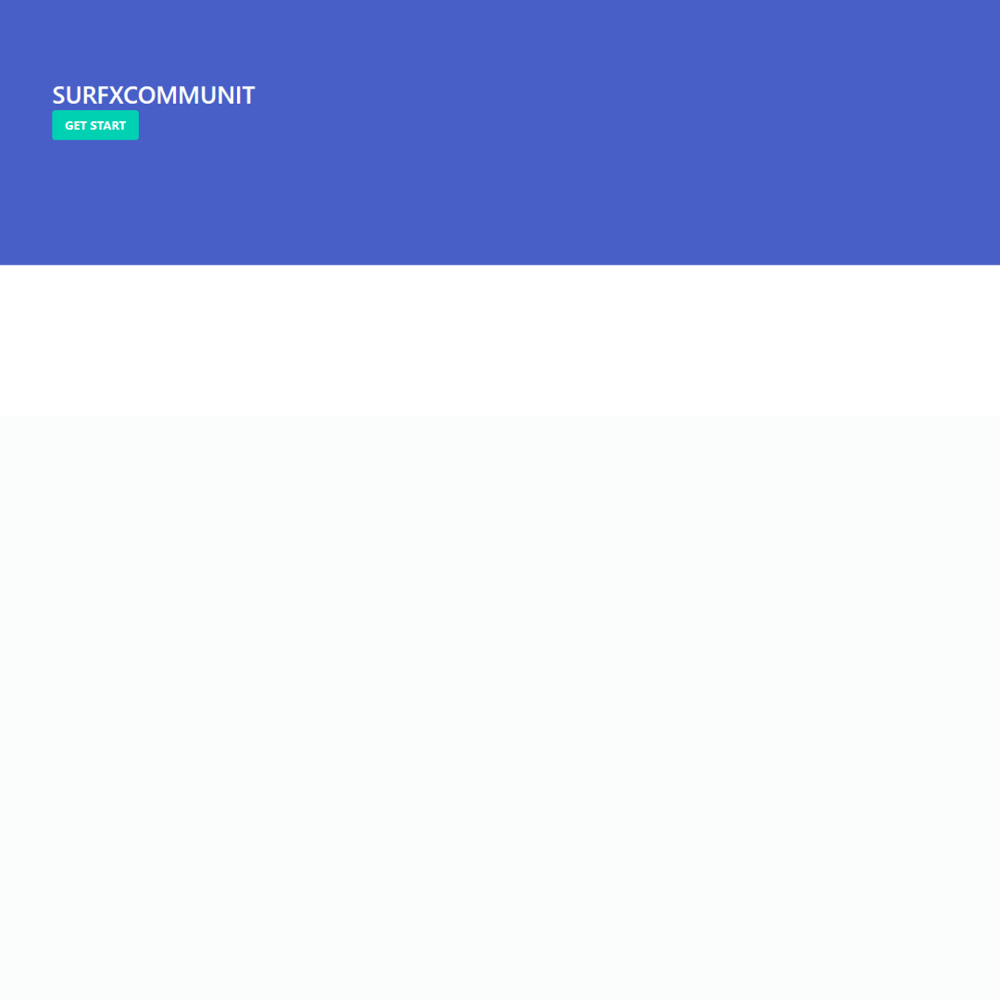
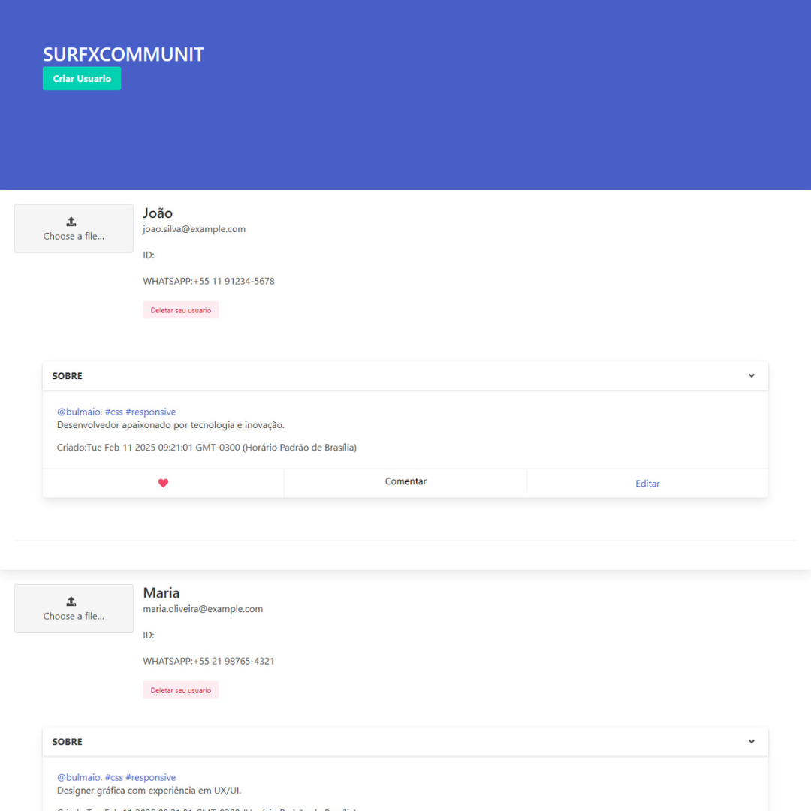

# Título do Projeto

Surf Connetion

# Ferramentas usadas

Aplicação em Node.js, express, EJS e MongoDB.

# Descrição

Desenvolvemos uma aplicação dedicada a fortalecer laços entre amigos próximos, proporcionando uma plataforma diária onde é possível verificar a disponibilidade para a prática conjunta de atividades físicas, como surf, corrida, pedalada, e outras modalidades. Nosso objetivo é criar um espaço virtual que incentive a prática saudável de exercícios, promovendo a união entre amigos por meio de atividades físicas compartilhadas. Com essa aplicação, facilitamos a organização de encontros para que todos possam desfrutar juntos de momentos ativos e saudáveis.

\*\* ALGUMAS FUNCIONALIDADE EM CONSTRUÇÃO.

**Screen 01 📷**

---

**Screen 02 📷**

## Instalação

git clone https://github.com/ivanmartins090317/surf-connection.git

cd into the cloned repository run
npm install

--Config local--

create a cluster on https://account.mongodb.com/account/login?n=https%3A%2F%2Fcloud.mongodb.com%2Fv2%2F65a84ae3cc89053571538ea7&nextHash=%23clusters&signedOut=true

check the local mongoDB connection:
mongodb://127.0.0.1:27017

after checks:
try running npm run start

## Referência

[Node.js] https://nodejs.org/api/fs.html

[Express] https://www.npmjs.com/package/express

[MongoDB] https://docs.mongodb.com/manual/installation/

## Autores

- [Ivan Martins] https://ivanmartins090317.github.io/linktree/
